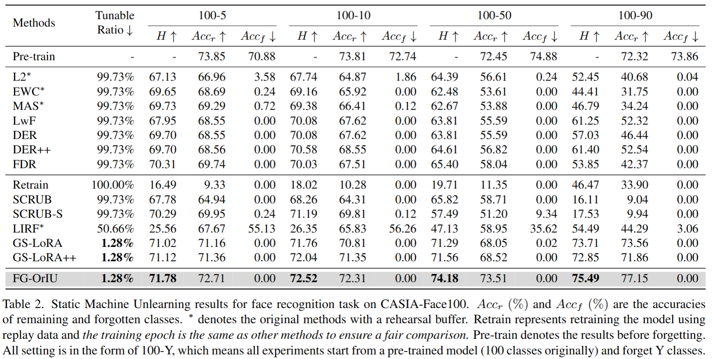
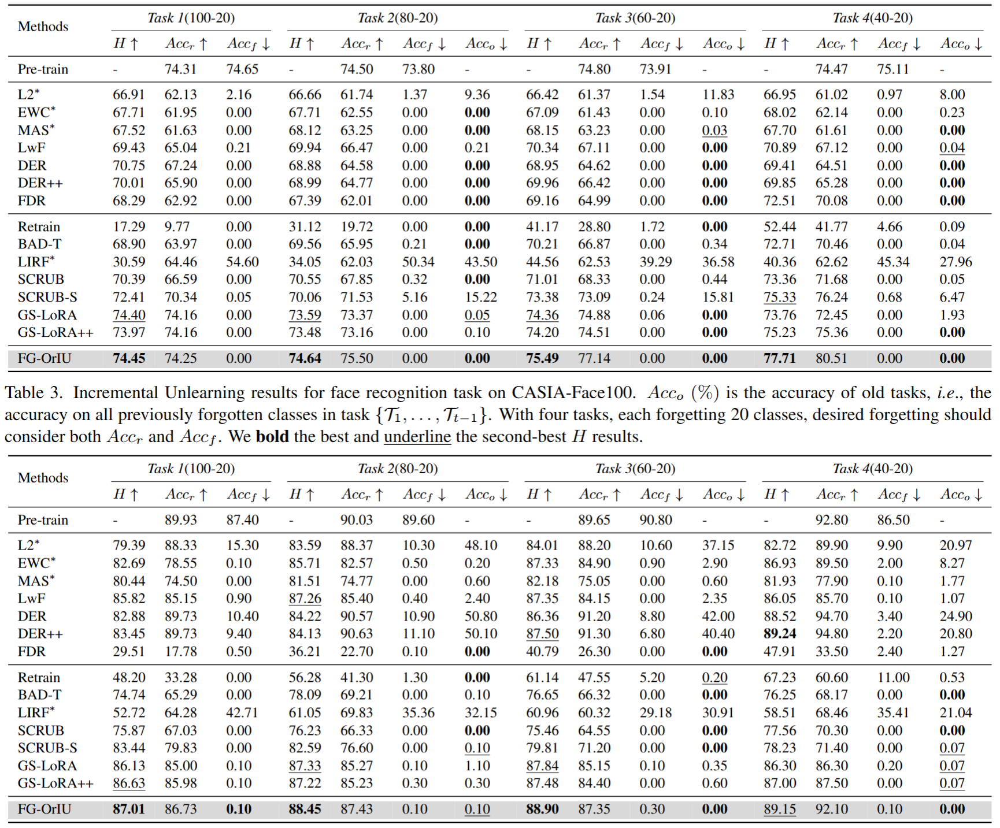

# FG-OrIU: Towards Better Forgetting via Feature-Gradient Orthogonality for Incremental Unlearning

Incremental unlearning (IU) is critical for pre-trained models to comply with sequential data deletion requests, yet existing methods primarily suppress parameters or confuse knowledge without explicit constraints on both feature and gradient level, resulting in \textit{superficial forgetting} where residual information remains recoverable. This incomplete forgetting risks security breaches and disrupts retention balance, especially in sequential unlearning scenarios. We propose FG-OrIU (\textbf{F}eature-\textbf{G}radient \textbf{Or}thogonality for \textbf{I}ncremental \textbf{U}nlearning), the first framework unifying orthogonal constraints on both features and gradients level to achieve irreversible forgetting. FG-OrIU decomposes feature spaces via Singular Value Decomposition (SVD), separating forgetting and retaining class features into distinct subspaces. It then enforces dual constraints: forward feature orthogonalization eliminates class correlations, while backward gradient projection prevents knowledge reactivation. For incremental tasks, dynamic subspace adaptation merges new forgetting subspaces and contracts retained subspaces, ensuring stable retention across sequential deletions. Extensive experiments on Face recognition and ImageNet Classification demonstrate the effectiveness and efficiency of our method.


## Method


## Experimental results

### Machine Unlearning



### Incremental Unlearning



## Getting Started

### Environment

```bash
conda create -n FGORIU python=3.9
pip install -r requirements.txt
```

#### c. Prepare the datasets

##### c.1 CASIA-100 dataset

```bash
mkdir data
cd data
unzip data.zip
```

CASIA-100 is a subdataset from  [CASIA-WebFace](https://paperswithcode.com/dataset/casia-webface) released by [GS-LoRA](https://github.com/bjzhb666/GS-LoRA)

##### c.2 ImageNet100 dataset

We follow [GS-LoRA](https://github.com/bjzhb666/GS-LoRA)
 to get ImageNet100 dataset from [ImageNet100](https://www.kaggle.com/datasets/ambityga/imagenet100).

##### c.3 Final File structure

```
.
├── faces_webface_112x112_sub100_train_test
│   ├── test
│   └── train
├── imagenet100
│   ├── imagenet_classes.txt
│   ├── test
│   └── train
└── Labels.json
```

## Reproduce Our Experiments

Please use `./scripts/IU_experiments/face/run.sh`.

and 

Please use `./scripts/IU_experiments/image/run.sh`.


## Acknowledgement

This work is heavily built upon the [GS-LoRA](https://github.com/bjzhb666/GS-LoRA). Many thanks.
