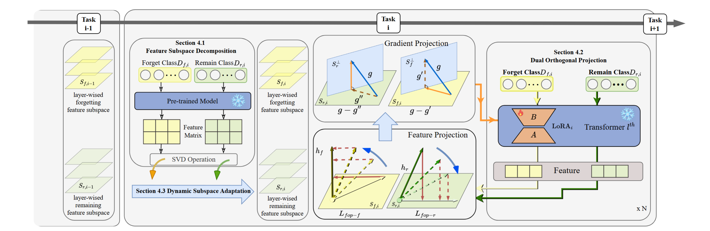

# [ICCV2025] FG-OrIU: Towards Better Forgetting via Feature-Gradient Orthogonality for Incremental Unlearning

# 
Incremental unlearning (IU) is critical for pre-trained models to comply with sequential data deletion requests, yet existing methods primarily suppress parameters or confuse knowledge without explicit constraints on both feature and gradient level, resulting in \textit{superficial forgetting} where residual information remains recoverable. This incomplete forgetting risks security breaches and disrupts retention balance, especially in sequential unlearning scenarios. We propose FG-OrIU (\textbf{F}eature-\textbf{G}radient \textbf{Or}thogonality for \textbf{I}ncremental \textbf{U}nlearning), the first framework unifying orthogonal constraints on both features and gradients level to achieve irreversible forgetting. FG-OrIU decomposes feature spaces via Singular Value Decomposition (SVD), separating forgetting and retaining class features into distinct subspaces. It then enforces dual constraints: forward feature orthogonalization eliminates class correlations, while backward gradient projection prevents knowledge reactivation. For incremental tasks, dynamic subspace adaptation merges new forgetting subspaces and contracts retained subspaces, ensuring stable retention across sequential deletions. Extensive experiments on Face recognition and ImageNet Classification demonstrate the effectiveness and efficiency of our method.

## Method

# code

We will release the source code soon.

